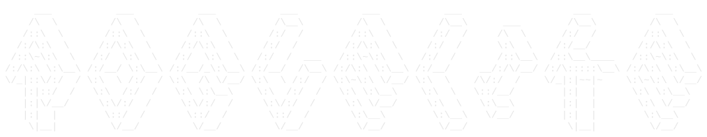

<p align="center">
  
</p>
<p align="center">
  
</p>

<p align="center">
  <em>An old-school, ASCII, text-based roguelike written in Rust.</em>
</p>

<p align="center">
  <a href="#about">About</a> •
  <a href="#getting-started">Getting Started</a> •
  <a href="#gameplay">Gameplay</a> •
  <a href="#roadmap">Roadmap</a> •
  <a href="#acknowledgements">Acknowledgements</a> •
  <a href="#license">License</a>
</p>

---

## About

**text_based_roguelike** is a classic, terminal-style roguelike built with the Rust [roguelike toolkit](https://bfnightly.bracketproductions.com/chapter_0.html) (bracket-lib). It follows the structure of the ["Roguelike Tutorial - In Rust"](https://bfnightly.bracketproductions.com/chapter_0.html) as a starting point for learning Rust, with the long-term goal of growing into its own, more unique dungeon-crawling experience.

This project exists first and foremost as a way to learn Rust fundamentals — expect the codebase to evolve quickly as new mechanics and ideas are layered on top of the original tutorial foundation.

## Features

- Classic ASCII/glyph-based rendering
- Procedurally generated dungeons
- Turn-based movement and combat
- Built entirely in Rust using the bracket-lib roguelike toolkit

> More features are being added as the project grows beyond its tutorial origins — see the [Roadmap](#roadmap) below.

## Getting Started

### Prerequisites

- [Rust](https://www.rust-lang.org/tools/install) (stable toolchain) and `cargo`

### Build & Run

```bash
# Clone the repository
git clone https://github.com/TSS71998/text_based_roguelike.git
cd text_based_roguelike/text_based_roguelike_project

# Build and run in debug mode
cargo run

# Or build an optimized release binary
cargo build --release
```

## Gameplay

Movement and actions use standard roguelike keybindings (arrow keys / numpad or vi-keys, depending on build configuration). Explore the dungeon, fight monsters, and try to survive as deep as you can — permadeath applies, as is roguelike tradition.

## Roadmap

- [ ] Expand beyond the base tutorial mechanics
- [ ] Add more enemy types and items
- [ ] Introduce a more unique world/story identity
- [ ] Polish UI/UX for terminal rendering
- [ ] Continued Optimizations

Contributions, ideas, and issue reports are welcome as this project develops.

## Acknowledgements

- Built with the [Rust Roguelike Tutorial](https://bfnightly.bracketproductions.com/chapter_0.html) by [Bracket Productions](https://bracketproductions.com/) as a foundation
- Powered by [bracket-lib](https://github.com/amethyst/bracket-lib)

## License

No license has been specified for this project yet. Until one is added, all rights are reserved by the repository owner.
